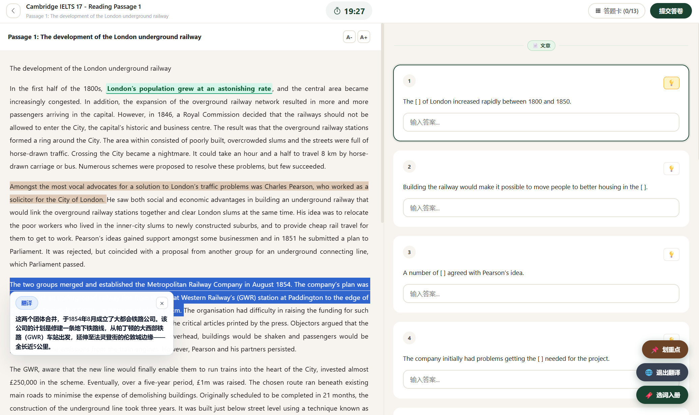
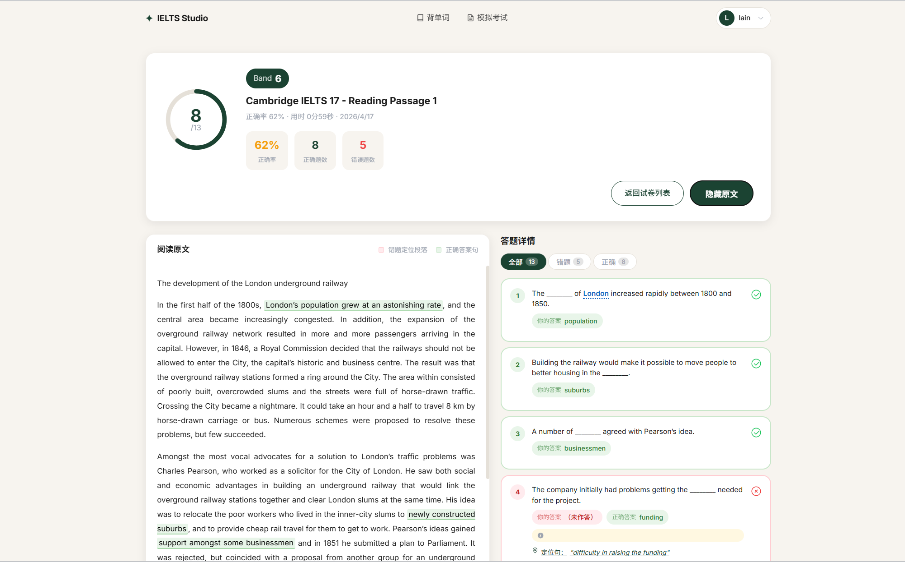
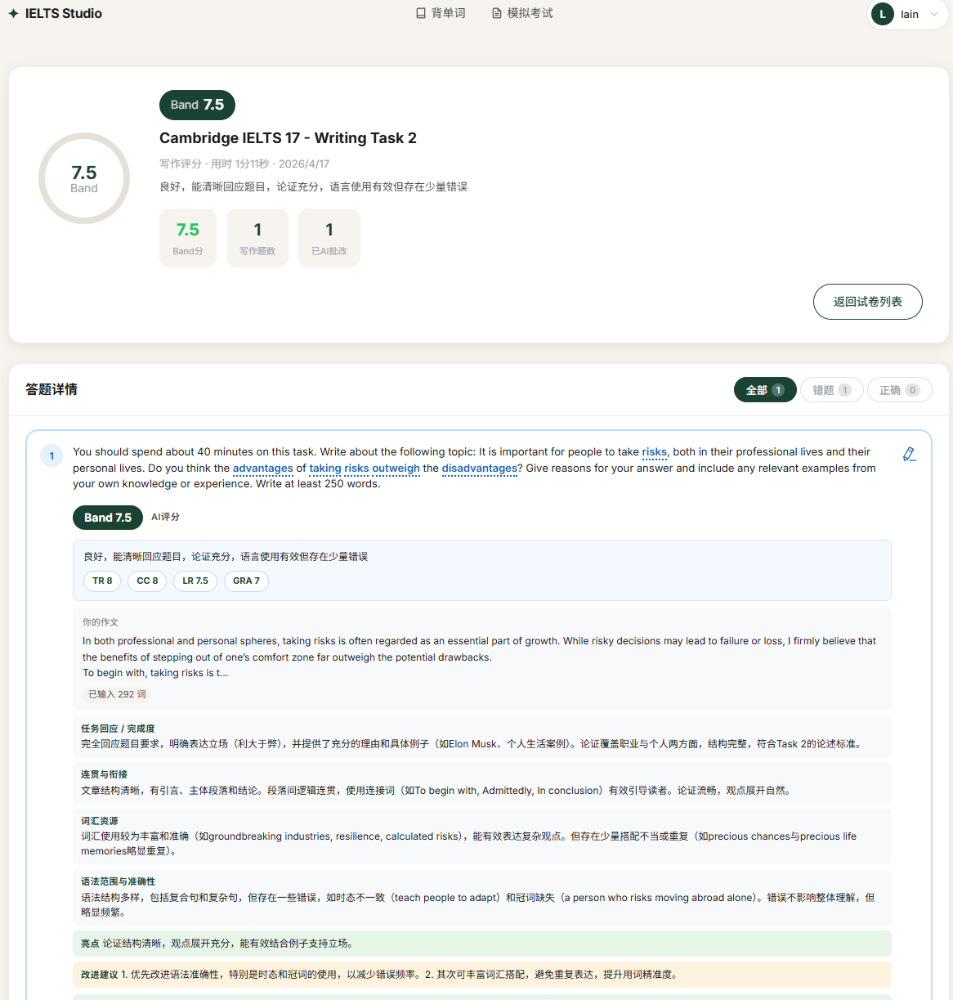
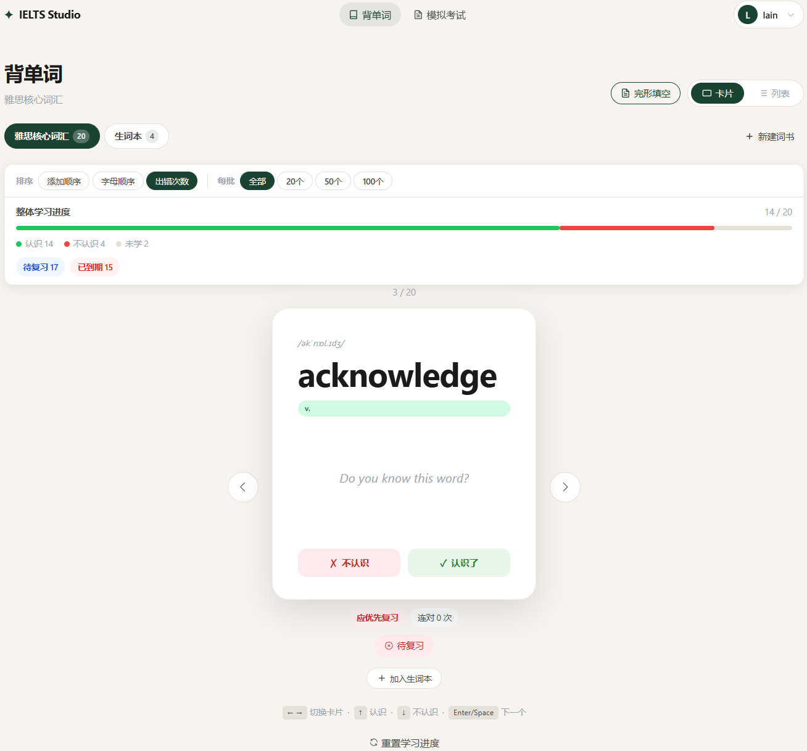
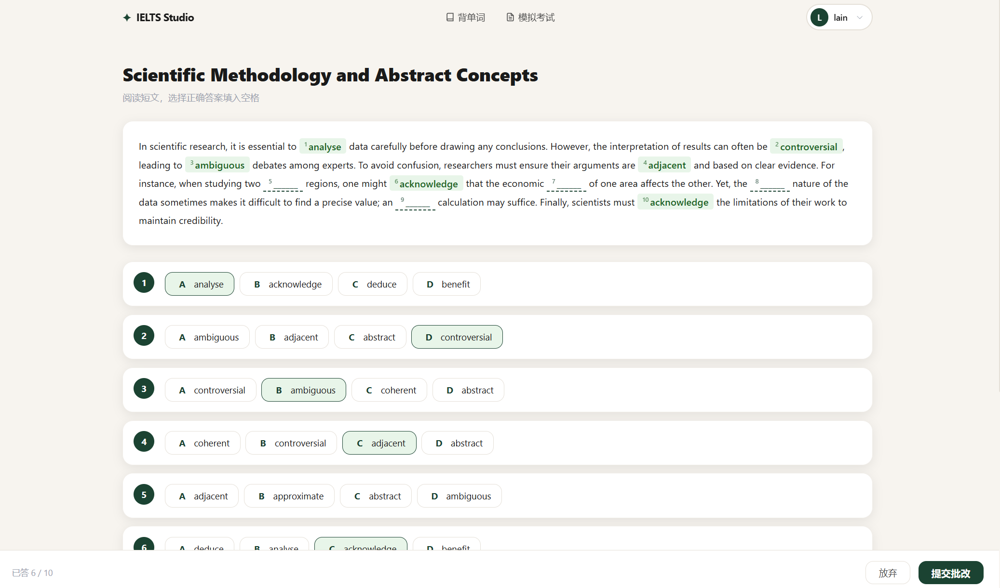

# IELTS Studio — 雅思备考平台

> **IELTS Studio** 是一款专为英语考生打造的**全流程机考模拟平台**。它能够将你手中的 PDF 或 Word 格式试卷，通过 AI 技术一键转化为可交互的网页机考界面，并提供智能写作批改与单词管理功能，助你提前适应机考节奏，高效备考。
>
> **🌐 在线访问：** [http://www.lainpeter.top:8888](http://www.lainpeter.top:8888)
>
> *(网站还在持续更新中，更多功能敬请期待下一次更新)*


## 网页预览

### 模拟机考界面（左文右题）


### AI 写作批改（智能反馈）

### 单词管理（AI 智能释义）

### 自选完形填空

---

## 目录

- [创作目的](#创作目的)
- [功能特性](#功能特性)
- [项目结构](#项目结构)
- [快速开始](#快速开始)
- [环境变量说明](#环境变量说明)
- [试卷解析模式](#试卷解析模式)
- [核心接口](#核心接口)
- [常见问题](#常见问题)
- [功能与建议](#功能与建议)

---

## 创作目的

作者最近在备考雅思。为了方便将平时获得的 PDF 和文档形式的试卷转化为网页版，从而更好地适应未来的**雅思电脑考试（机考）**环境，特别创建了这个网站。

希望这个工具能帮助更多雅思考生模拟真实的机考体验。

---

## 功能特性

| 功能模块 | 说明 |
|---|---|
| 用户注册 / 登录 | JWT 无状态认证，支持用户名或邮箱登录 |
| 试卷上传 | 支持 PDF、DOC、DOCX，后台异步解析 |
| 普通解析 | 浏览器端 pdf.js 提取文字，扫描版自动 OCR 回退 |
| 精准解析 | 接入 Qwen 视觉模型，适合多栏/扫描/图片版试卷 |
| 模拟考试 | 左侧原文、右侧题目、倒计时、答题卡 |
| 结果回顾 | 正误统计、错题解析、原文定位高亮 |
| 写作 AI 评分 | DeepSeek 多维度评分（TR / CC / LR / GRA）+ Band 分 |
| 错题本 | 自动收录答错题目，支持标记已掌握 |
| 词书管理 | 创建词书、添加/导入单词、AI 自动查询释义 |

---


## 项目结构

```
ielts-studio/
├── frontend/                          # Vue 3 + Vite 前端
│   ├── src/
│   │   ├── api/
│   │   │   ├── index.js               # Axios 实例（拦截器、Token 注入）
│   │   │   └── auth.js                # 认证 API（含 Mock 降级）
│   │   ├── stores/
│   │   │   ├── auth.js                # 用户登录态管理（Pinia）
│   │   │   ├── exam.js                # 试卷/答题状态管理
│   │   │   └── word.js                # 词书状态管理
│   │   ├── views/
│   │   │   ├── HomeView.vue           # 首页
│   │   │   ├── LoginView.vue          # 登录页
│   │   │   ├── RegisterView.vue       # 注册页
│   │   │   ├── ExamsView.vue          # 试卷列表 + 上传
│   │   │   ├── ExamView.vue           # 考试页（左文右题）
│   │   │   ├── ResultView.vue         # 结果回顾页
│   │   │   ├── WordsView.vue          # 词书管理页
│   │   │   └── ProfileView.vue        # 个人中心
│   │   ├── components/
│   │   │   ├── NavBar.vue             # 顶部导航栏
│   │   │   └── WordCard.vue           # 单词卡片组件
│   │   ├── router/index.js            # 路由配置（含路由守卫）
│   │   ├── utils/pdfExtract.js        # 浏览器端 PDF 文字提取
│   │   └── main.js                    # 应用入口
│   ├── .env.example                   # 环境变量示例
│   └── vite.config.js
│
└── backend/                           # Spring Boot 3 后端
    └── src/main/java/com/ieltsstudio/
        ├── controller/                # 接口层（路由 + 参数接收）
        │   ├── AuthController.java    # /auth/*
        │   ├── ExamController.java    # /exams/*
        │   ├── UserController.java    # /users/*
        │   └── WordBookController.java# /words/*
        ├── service/                   # 业务逻辑层
        │   ├── AuthService.java       # 注册/登录/个人信息
        │   ├── ExamService.java       # 试卷核心逻辑（判分/记录/错题）
        │   ├── AsyncParseService.java # 异步解析调度
        │   ├── AiParseService.java    # DeepSeek 解析 + 写作评分
        │   ├── QwenAiParseService.java# 通义千问视觉解析（精准模式）
        │   ├── FileParseService.java  # 文件读取（PDF/Word 文字提取）
        │   ├── WordBookService.java   # 词书/词条管理
        │   └── AsyncWordService.java  # 单词批量导入（异步）
        ├── config/
        │   ├── SecurityConfig.java    # Spring Security + CORS 配置
        │   └── MyBatisPlusConfig.java # 自动填充时间字段
        ├── security/
        │   ├── JwtUtil.java           # JWT 生成/解析/校验
        │   ├── JwtAuthenticationFilter.java  # JWT 请求过滤器
        │   ├── JwtAuthenticationEntryPoint.java # 未认证返回 JSON
        │   └── AuthUser.java          # 认证用户信息载体
        ├── common/Result.java         # 统一 API 响应格式
        ├── exception/GlobalExceptionHandler.java # 全局异常处理
        ├── entity/                    # 数据库实体类
        ├── mapper/                    # MyBatis-Plus Mapper 接口
        ├── dto/                       # 请求/响应 DTO
        └── util/
            ├── JwtUtil.java           # JWT 工具
            └── TfIdfUtil.java         # TF-IDF 关键词提取（原文定位）
```

---

## 快速开始

### 1. 环境准备

请确保本机已安装以下软件：

| 依赖 | 版本要求 | 下载地址 |
|---|---|---|
| JDK | 17+ | https://adoptium.net |
| Maven | 3.9+ | https://maven.apache.org |
| Node.js | 18+ | https://nodejs.org |
| MySQL | 8.0+ | https://dev.mysql.com/downloads |

> Redis 和 MinIO 为可选依赖，不配置时相关功能会降级，不影响核心流程。

---

### 2. 克隆项目

```bash
git clone https://github.com/your-username/ielts-studio.git
cd ielts-studio
```

---

### 3. 初始化数据库

登录 MySQL 并执行初始化脚本：

```bash
mysql -u root -p < backend/src/main/resources/db/init.sql
```

脚本会自动创建 `ielts_studio` 数据库和全部数据表。

---

### 4. 配置后端

编辑 `backend/src/main/resources/application.yml`，至少需要修改以下字段：

```yaml
spring:
  datasource:
    url: jdbc:mysql://localhost:3306/ielts_studio?useUnicode=true&characterEncoding=utf-8&serverTimezone=Asia/Shanghai&useSSL=false&allowPublicKeyRetrieval=true
    username: root          # 改为你的 MySQL 用户名
    password: your_password  # 改为你的 MySQL 密码

ai:
  deepseek:
    api-key: your_deepseek_api_key   # DeepSeek API Key（题目解析 + 写作评分）

qwen:
  api-key: your_dashscope_api_key   # DashScope API Key（精准解析，可选）
```

**如何获取 API Key：**
- DeepSeek：访问 [platform.deepseek.com](https://platform.deepseek.com) 注册后创建
- DashScope（Qwen）：访问 [dashscope.aliyuncs.com](https://dashscope.aliyuncs.com) 开通服务后获取

> 未配置 Qwen API Key 时，精准解析功能不可用；未配置 DeepSeek API Key 时，解析和写作评分均不可用。

---

### 5. 启动后端

```bash
cd backend
mvn spring-boot:run
```

启动成功后，接口地址为：`http://localhost:8080/api`

---

### 6. 配置前端

在 `frontend` 目录下创建 `.env.local` 文件：

```bash
# frontend/.env.local
VITE_API_BASE_URL=http://localhost:8080/api
```

---

### 7. 启动前端

```bash
cd frontend
npm install       # 首次运行安装依赖
npm run dev       # 启动开发服务器
```

启动成功后，访问：`http://localhost:3000`

---

## 环境变量说明

### 后端（application.yml）

| 配置项 | 说明 | 是否必填 |
|---|---|---|
| `spring.datasource.username` | MySQL 用户名 | ✅ |
| `spring.datasource.password` | MySQL 密码 | ✅ |
| `ai.deepseek.api-key` | DeepSeek API Key | ✅（核心功能依赖） |
| `qwen.api-key` | 阿里云 DashScope API Key | ⬜ 可选（精准解析） |
| `jwt.secret` | JWT 签名密钥 | ✅（生产环境必须更换） |
| `spring.data.redis.*` | Redis 连接配置 | ⬜ 可选 |
| `minio.*` | MinIO 对象存储 | ⬜ 可选（预留扩展） |

### 前端（.env.local）

| 变量名 | 说明 | 默认值 |
|---|---|---|
| `VITE_API_BASE_URL` | 后端 API 地址 | `/api` |

---

## 试卷解析模式

上传试卷时可选择两种解析模式：

### 普通解析（推荐优先尝试）

**适合：** 文字可选中的普通 PDF、Word 文档、开发阶段快速测试

**流程：**
```
浏览器 pdf.js 提取文字
  → 文字过少时自动尝试 tesseract.js OCR
  → 将提取结果上传到后端
  → DeepSeek AI 结构化解析题目
```

**优势：** 速度快、费用低  
**局限：** 对多栏排版、复杂表格、图形内容的稳定性稍弱

---

### 精准解析（复杂试卷推荐）

**适合：** 双栏/多栏 PDF、扫描版、图片版试卷、普通解析顺序混乱时

**流程：**
```
后端将 PDF 逐页渲染为图片（160 DPI）
  → 调用 Qwen 视觉模型转写每页内容
  → 按 section 分块后 AI 结构化解析
  → 保留原始题号，合并多篇 passage
```

**优势：** 解析质量高，适合复杂排版  
**局限：** 耗时较长（依赖外部 API），建议解析后人工复核

---

**上传建议：**
- 按题型分开上传（阅读和写作分别上传，不要混在一个文件中）
- 包含大量表格/流程图的试卷，优先使用精准解析
- Word 文件优先于 PDF（普通解析更稳定）

---

## 核心接口

### 认证接口（无需 Token）

| 路径 | 方法 | 说明 |
|---|---|---|
| `/api/auth/register` | POST | 用户注册 |
| `/api/auth/login` | POST | 用户登录（返回 JWT Token） |
| `/api/auth/profile` | GET | 获取当前用户信息 |
| `/api/auth/logout` | POST | 退出登录 |

### 试卷接口（需携带 Token）

| 路径 | 方法 | 说明 |
|---|---|---|
| `/api/exams` | GET | 获取我的试卷列表 |
| `/api/exams/upload` | POST | 上传试卷（multipart） |
| `/api/exams/{id}` | GET | 获取试卷详情 |
| `/api/exams/{id}/questions` | GET | 获取试卷题目 |
| `/api/exams/{id}` | DELETE | 删除试卷（级联删除） |
| `/api/exams/submit` | POST | 提交答案 |
| `/api/exams/history` | GET | 考试历史列表 |
| `/api/exams/records/{id}` | GET | 单次记录详情 |
| `/api/exams/records/{id}/ai-feedback` | PATCH | 保存 AI 写作反馈 |
| `/api/exams/errors` | GET | 我的错题本 |
| `/api/exams/grade-writing` | POST | 写作 AI 评分 |

### 用户 / 词书接口

| 路径 | 方法 | 说明 |
|---|---|---|
| `/api/users/me` | GET / PUT | 查询 / 修改用户信息 |
| `/api/users/me/password` | PUT | 修改密码 |
| `/api/words/books` | GET / POST | 词书列表 / 创建词书 |
| `/api/words/books/{id}/entries` | GET | 词书词条列表 |
| `/api/words/books/default/quick-add` | POST | 快速批量添加单词 |

---

## 常见问题

### 前端访问不到后端接口

1. 确认后端已启动，默认端口 `8080`
2. 检查 `frontend/.env.local` 中 `VITE_API_BASE_URL` 是否正确
3. 打开浏览器开发者工具 → Network，查看请求状态码：
   - `401`：未登录或 Token 过期
   - `404`：接口路径错误（检查是否缺少 `/api` 前缀）
   - `500`：后端异常（查看后端控制台日志）

---

### 数据库连接失败

检查 `application.yml` 中数据库配置，常见错误：
- 密码错误：`Access denied for user`
- 数据库不存在：先执行 `db/init.sql` 初始化
- 时区问题：URL 中已包含 `serverTimezone=Asia/Shanghai`，如仍报错请检查 MySQL 服务器时区设置

---

### 试卷解析后题目为空

- 检查 `ai.deepseek.api-key` 是否已配置且有效
- 后端日志中搜索 `[AsyncParseService]` 查看解析过程
- 普通 PDF 文字提取为空时，可尝试切换精准解析模式

---

### 精准解析无结果

- 检查 `qwen.api-key` 是否配置（阿里云 DashScope）
- 查看后端日志中 `[QwenAiParseService]` 相关输出
- 确认网络可访问 `dashscope.aliyuncs.com`

---

### 写作评分失败

- 检查 `ai.deepseek.api-key` 配置
- 确认写作内容不为空、不过短（建议 50 词以上）
- 查看后端日志中 `[AiParseService]` 输出

---

## 开发指引

### 推荐扩展方向

| 方向 | 入口文件 |
|---|---|
| 试卷上传/解析逻辑 | `backend/service/AsyncParseService.java` |
| AI 解析 Prompt 调整 | `backend/service/AiParseService.java` |
| 考试页 UI | `frontend/views/ExamView.vue` |
| 结果页 UI | `frontend/views/ResultView.vue` |
| 试卷列表/上传 | `frontend/views/ExamsView.vue` |

### 常用命令

```bash
# 前端
npm run dev        # 启动开发服务器
npm run build      # 生产构建
npm run preview    # 预览构建产物

# 后端
mvn spring-boot:run     # 启动
mvn clean package       # 打包为 jar
```

---

## 功能与建议

目前项目处于开发初期，新功能正在持续添加中，如果你对软件有任何功能与建议，欢迎在 **Issues** 中提出。

如果你也喜欢本软件的设计思想，欢迎提交 **PR**，非常感谢你对我们的支持！

---

## License

本项目仅供学习与个人开发使用，请勿用于商业目的。
# IELTS-Studio
